# Sentinel AI — Database Schema

PostgreSQL (production) / H2 (local, tests). 25 tables, 12 foreign keys, evolved
through Flyway migrations V1–V15. Multi-tenant by a `tenant_id` discriminator;
`users.tenant_id` is FK-enforced against the canonical `tenants` registry.

See [database-hardening.md](database-hardening.md) for the design decisions
(free-form `text`, foreign keys, tenant registry, FK indexes, and the deliberately
skipped enum CHECK constraints).

```mermaid
erDiagram
    tenants ||--o{ users : "has"
    deployments ||--o{ deployment_dependencies : ""
    deployments ||--o{ deployment_signals : ""
    deployments ||--o{ deployment_risk_reasons : ""
    deployments ||--o{ incidents : ""
    deployments ||--o{ memory_links : ""
    deployments ||--o{ pull_request_reviews : "linked"
    engineering_events ||--o{ memory_links : ""
    incidents ||--o{ incident_timeline_events : ""
    integration_connections ||--o{ integration_sync_events : ""
    pull_request_reviews ||--o{ pull_request_changed_files : ""
    service_profiles ||--o{ service_profile_dependencies : ""

    tenants {
        varchar tenant_id PK
        varchar organization_name
        timestamptz created_at
    }
    users {
        bigint id PK
        varchar tenant_id FK
        varchar email UK
        varchar role
        timestamptz created_at
    }
    deployments {
        bigint id PK
        varchar tenant_id
        varchar deployment_key
        varchar service_name
        varchar environment
        varchar status
        int score
        varchar risk_level
        text ai_explanation
    }
    deployment_dependencies {
        bigint deployment_id FK
        int sort_order
        varchar dependency_name
    }
    deployment_signals {
        bigint deployment_id FK
        int sort_order
        varchar signal_type
        int risk_weight
    }
    deployment_risk_reasons {
        bigint deployment_id FK
        int sort_order
        varchar category
        int impact
    }
    engineering_events {
        bigint id PK
        varchar tenant_id
        varchar service_name
        varchar event_type
        text details
        timestamptz occurred_at
    }
    memory_links {
        bigint id PK
        varchar tenant_id
        bigint deployment_id FK
        bigint engineering_event_id FK
        varchar pattern_type
        int confidence
    }
    pull_request_reviews {
        bigint id PK
        varchar tenant_id
        bigint linked_deployment_id FK
        varchar decision
        text explanation
    }
    pull_request_changed_files {
        bigint pull_request_review_id FK
        varchar changed_file
    }
    incidents {
        bigint id PK
        varchar tenant_id
        varchar incident_key UK
        bigint deployment_id FK
        varchar status
        varchar severity
        text summary
    }
    incident_timeline_events {
        bigint incident_id FK
        timestamptz occurred_at
        varchar actor
        varchar label
    }
    integration_connections {
        bigint id PK
        varchar tenant_id
        varchar provider
        varchar status
        varchar external_account
        int health_score
    }
    integration_token_secrets {
        bigint id PK
        varchar secret_ref UK
        varchar tenant_id
        varchar provider
        text encrypted_access_token
    }
    integration_sync_events {
        bigint id PK
        varchar tenant_id
        bigint integration_connection_id FK
        varchar status
        text detail
    }
    webhook_deliveries {
        bigint id PK
        varchar tenant_id
        varchar provider
        varchar external_delivery_id
        varchar status
        text payload
    }
    background_jobs {
        bigint id PK
        varchar tenant_id
        varchar job_type
        varchar status
        varchar target_type
        bigint target_id
        timestamptz next_run_at
    }
    architecture_services {
        bigint id PK
        varchar tenant_id
        varchar service_name
        varchar tier
        text description
    }
    architecture_dependencies {
        bigint id PK
        varchar tenant_id
        varchar source_service
        varchar target_service
        varchar dependency_type
    }
    architecture_risks {
        bigint id PK
        varchar tenant_id
        varchar risk_type
        varchar severity
        text explanation
    }
    service_profiles {
        bigint id PK
        varchar tenant_id
        varchar service_name
    }
    service_profile_dependencies {
        bigint service_profile_id FK
        varchar target_service
    }
    audit_events {
        bigint id PK
        varchar tenant_id
        varchar actor
        varchar action
        varchar target
        timestamptz created_at
    }
    ai_usage_events {
        bigint id PK
        varchar tenant_id
        varchar model
        int total_tokens
        timestamptz created_at
    }
    error_events {
        bigint id PK
        varchar tenant_id
        varchar error_type
        text message
        timestamptz occurred_at
    }
```

